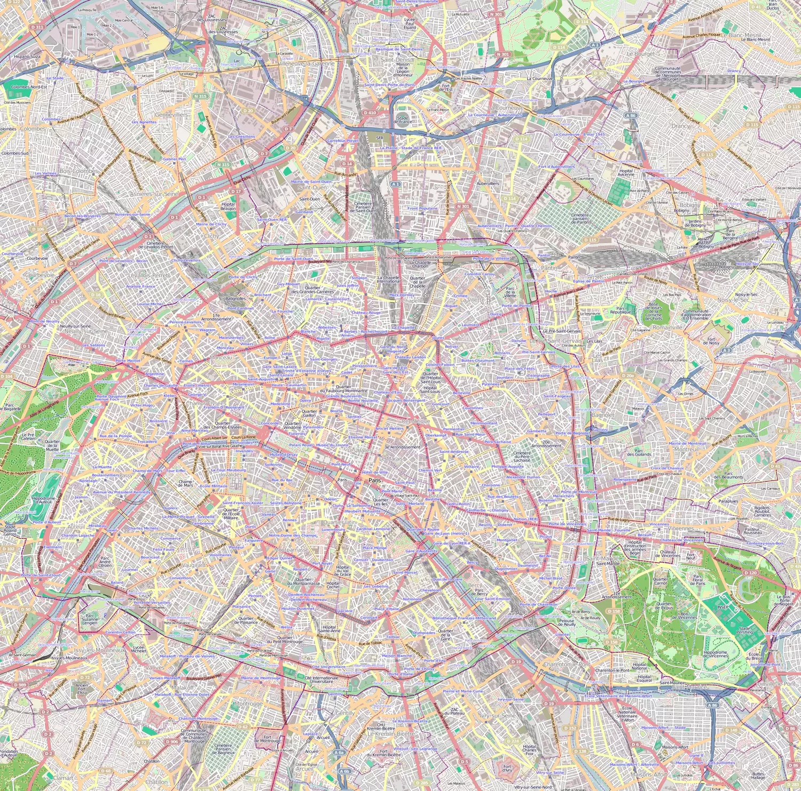
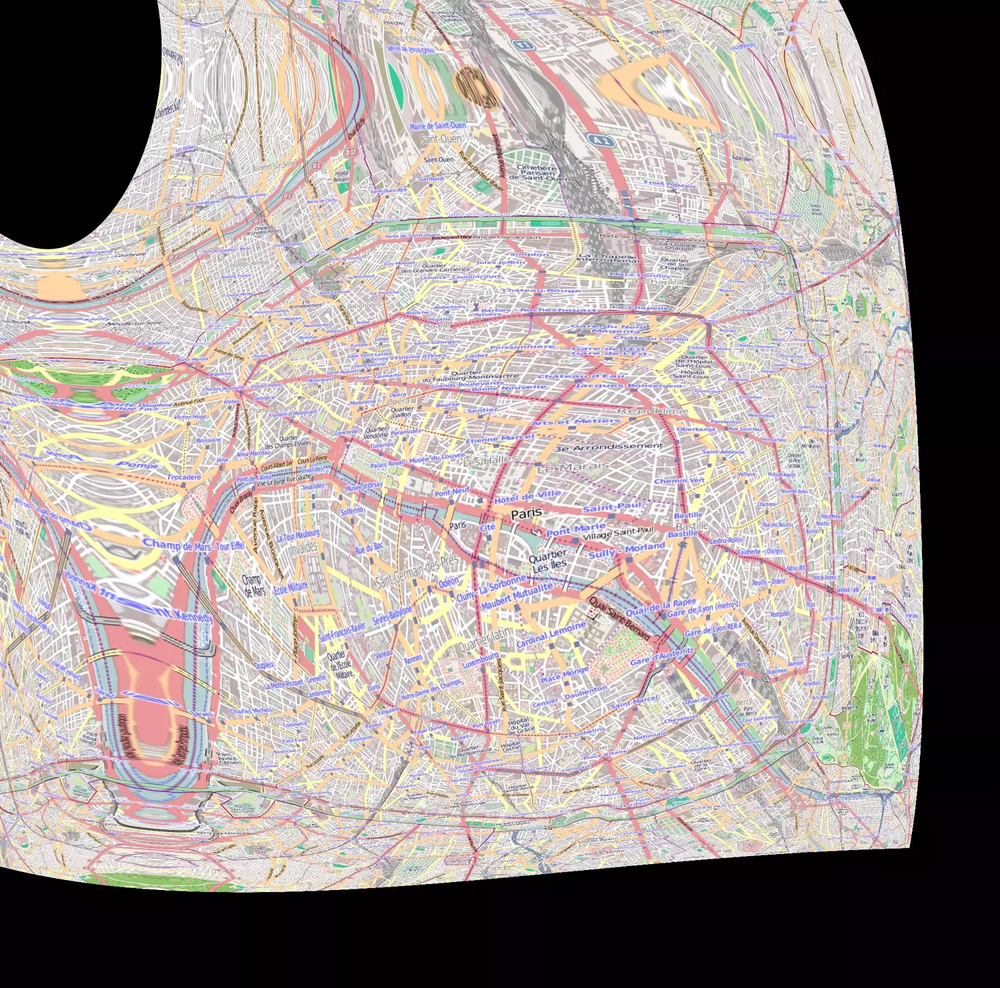
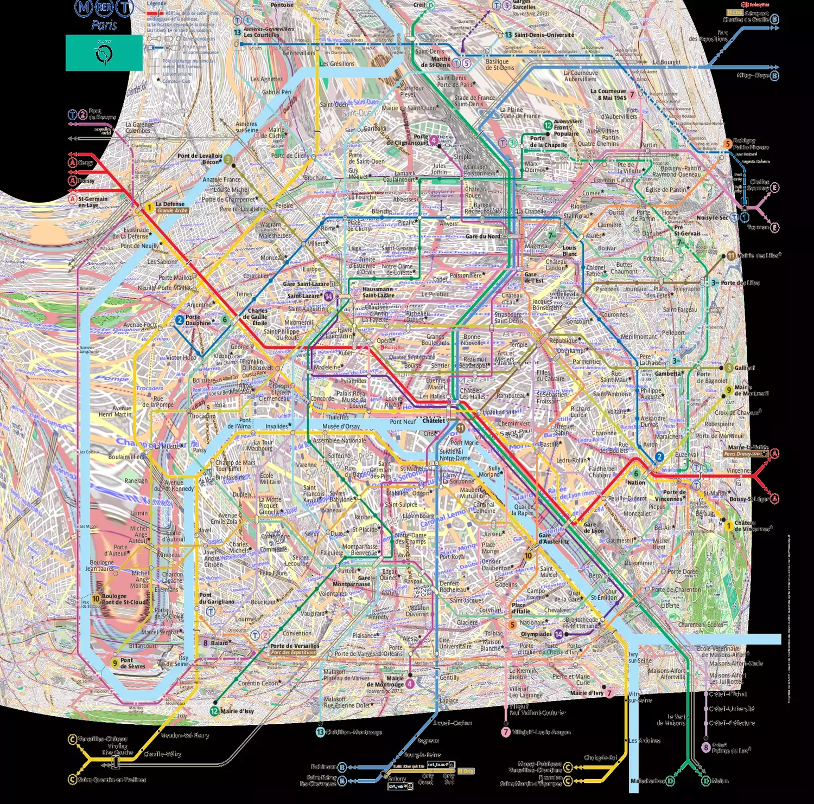

+++
category = "tech"
date = 2013-05-25
title = "OpenDataLab : ouverture des données RATP"
+++

# Introduction

Moment historique : La RATP a ouvert ses données horaires ! Avec celles
Transilien ouvertes il y a un an, la couverture de Paris et de la petite
ceinture est très bonne. Il ne manque plus que les données Optile
(réseau d’environ 90 transporteurs) pour avoir des données complètes sur
l’Île-de-France.

Allez jeter un coup d’œil à leur site : <http://data.ratp.fr/>

Pour faire un peu de communication, un hackathon (ou plutôt un concours
d’applications) nommé « OpenDataLab » a été organisé ce week-end précédé
d’une conférence.

# Impressions

J’ai vraiment apprécié les efforts pédagogiques de la RATP pour
expliquer comment sont construits les horaires et leur effort
d’expliquer le format GTFS des horaires. Même si c’est probablement le
format le plus simple et plus simplistes pour représenter des horaires
de transport en commun, la prise en main est rude (merci de ne pas avoir
fourni du Trident brut ;) ).

Une grande partie des mentors étaient de la RATP, ce qui a permis des
échanges informels et très intéressants qu’on a pas l’habitude d’avoir.
Je pense que c’est vraiment l’aspect le plus important de ce genre
d’évènement et il faudrait trouver une idée pour le faciliter.

# Ma réalisation

Entre deux échanges, j’ai fait mon mini-projet utilisant les données de
la RATP en mettant une contrainte : ne pas coder, seulement utiliser un
tableur (à la grande perplexité de Andrew ;) ). Je pense en effet qu’il
est important que l’opendata s’ouvre un peu plus à ceux qui ne veulent
pas forcément créer une killer-app.

J’ai donc voulu essayer de reproduire ceci :
<http://www.fastcodesign.com/1669080/what-if-londons-geography-were-as-distorted-as-its-tube-map>

Le plan schématique du métro de la RATP est déformé. Ça lui permet
d’être lisible mais les distances ne collent pas. L’idée est donc de
déformer une carte réaliste de Paris pour qu’elle colle au plan de la
RATP.

C’est bien évidemment parfaitement inutile. C’est avec une très grande
minutie que je ne répondais à aucun critère de la grille d’évaluation

-   apporter un plus aux voyageurs
-   mashup de plusieurs source de donnése
-   être viable

## Choix des données

1.  La position réelles des stations
2.  La position sur le plan schématique des stations

Ces données sont proposées par la RATP. Il ne reste plus qu’à les
fusionner. Pour cela une *RECHERCHEV* (ou *VLOOKUP*) dans votre tableur
préféré fera l’affaire.

On sait donc faire correspondre les coordonnées à des pixels dans le
plan RATP de 8000×8000 pixels (et oui ! il faut lire la doc livrée avec
les jeux de données pour savoir ça ;) ).

## Choix du plan initial

J’ai pas fait très compliqué, je suis allé sur
<http://openstreetmap.org>, j’ai cliqué sur *export*, j’ai choisi la
zone qui m’intéresse tout en notant les coordonnées de mon export et la
taille du fichier obtenu.

Un produit en croix et j’arrive à faire correspondre les pixels RATP et
les coordonnées des stations sur les pixels de mon image.

Ainsi je sais que la station Gambeta est aux coordonnées 1500×800 du
plan OSM, mais si on utilisait le plan schématique, elle serait en
1600×850.

Après un peu de nettoyage à la main des données qui ne collent pas,
j’obtiens un fichier qui contient des pixels avant et après déformation
selon le plan schématique RATP.

## Appliquer ces transformations

Il ne reste plus qu’à donner ce fichiers de 400 points avant/après à un
logiciel de traitement d’image qui va faire la transformation pour nous.

C’est que ça se gâte. Je n’ai pas trouvé d’outil vraiment satisfaisant.
Je me suis rabattu sur
[ImageMagick](http://www.imagemagick.org/Usage/distorts/#polynomial) qui
accepte des fichiers d’entrée pour les distorsions.

La seule manière qui donnait des résultats acceptable était la
transformation *Polynomial* qui lisse un peu trop le rendu, n’accentuant
pas assez les déformations ponctuelles. Une déformation en Mesh est
annoncée, mais pas encore disponible.

Voici le résultat (clic-droit afficher l’image pour l’avoir un plus
grand) :

# Conclusion

Merci encore à la RATP pour les données et les échanges.

J’ai plus ou moins réussi mon challenge de faire une dataviz basée sur
de l’OpenData sans coder.

J’espère juste l’ouverture de ces données ira un peu plus loin d’un
évènement ponctuel. La valeur de ces données mérite beaucoup plus qu’une
simple application. Il faut impliquer la recherche à plus long terme, il
faudrait réussir à enfin créer un éco-systèmes d’entreprises qui
s’entraideraient et créons des projets artistiques : la RATP c’est le
quotidien de millions de personnes, elle nous amène à notre rendez-vous
galant, elles nous met hors de nous quand ça se grippe, elle transforme
notre vision de la ville, tant de choses à exprimer autrement qu’en
HTML5.
